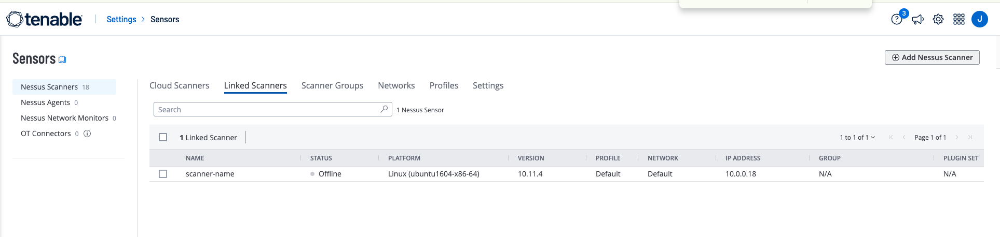

# Architecture
Prerequisites:
1. AWS Account
2. Nessus Tenable One license
3. [Vault CLI](https://developer.hashicorp.com/vault/install)

## Create Private Link

1. Make sure you have all the prerequisites, then load env vars:

```sh
set -a && source .env && set +a
```

2. Create the PrivateLink service:
```sh
curl --location "https://api.cloud.hashicorp.com/network/2020-09-07/organizations/$HCP_ORG_ID/projects/$HCP_PROJ_ID/networks/$HCP_NETWORK_ID/private-link-services" \
 --request POST \
 --header 'Content-Type: application/json' \
 --header "Authorization: Bearer $HCP_API_TOKEN" \
 --data "{
     \"private_link_service\": {
         \"id\": \"privatelink-service\",
         \"vault_cluster_id\": \"vault-cluster\",
         \"consumer_accounts\": [\"$CONSUMER_ACCOUNT\"],
         \"consumer_ip_ranges\": [\"$CONSUMER_IP_RANGES\"],
         \"hvn\": {
             \"location\": {
                 \"region\": {
                     \"region\": \"$AWS_REGION\",
                     \"provider\": \"aws\"
                 }
             }
         }
     }
 }" | jq
```

3. Get the external service name (used when creating the AWS VPC endpoint):
```sh
export PRIVATELINKID="privatelink-service"

EXTERNAL_NAME=$(curl --location "https://api.cloud.hashicorp.com/network/2020-09-07/organizations/$HCP_ORG_ID/projects/$HCP_PROJ_ID/networks/$HCP_NETWORK_ID/private-link-services/$PRIVATELINKID" \
  --header "Authorization: Bearer $HCP_API_TOKEN" | jq -r '.private_link_service.external_name')

echo "$EXTERNAL_NAME"
```

4. Poll until the service `state` is `AVAILABLE`:
```sh
until [ "$(curl --location "https://api.cloud.hashicorp.com/network/2020-09-07/organizations/$HCP_ORG_ID/projects/$HCP_PROJ_ID/networks/$HCP_NETWORK_ID/private-link-services/$PRIVATELINKID" \
  --header "Authorization: Bearer $HCP_API_TOKEN" | jq -r '.private_link_service.state')" = "AVAILABLE" ]; do
  sleep 5
done
```

5. Create a security group allowing inbound TCP 8200 from `$CONSUMER_IP_RANGES`, then create the consumer-side VPC endpoint in AWS, pointing at `$EXTERNAL_NAME`:
```sh
VPCE_SG_ID=$(aws ec2 create-security-group \
  --group-name vault-privatelink-endpoint \
  --description "Allow Vault (8200) from consumer IP ranges" \
  --vpc-id "$CONSUMER_VPC_ID" \
  --query 'GroupId' --output text)

aws ec2 authorize-security-group-ingress \
  --group-id "$VPCE_SG_ID" \
  --protocol tcp --port 8200 \
  --cidr "$CONSUMER_IP_RANGES"

VPC_ENDPOINT_ID=$(aws ec2 create-vpc-endpoint \
  --vpc-endpoint-type Interface \
  --vpc-id "$CONSUMER_VPC_ID" \
  --subnet-ids $CONSUMER_SUBNET_IDS \
  --security-group-ids "$VPCE_SG_ID" \
  --service-name "$EXTERNAL_NAME" \
  --query 'VpcEndpoint.VpcEndpointId' --output text)
```

6. Add Route53 Private Hosted Zone

Private DNS names are disabled by default on the endpoint (AWS can't verify ownership of HCP's domain), so resolve the Vault hostname manually. Set `VAULT_FULL_DOMAIN_NAME` in `.env` to the Vault cluster's private endpoint hostname (from the HCP Vault cluster's "Private connectivity" details):
```sh
HOSTED_ZONE_ID=$(aws route53 create-hosted-zone \
  --name "$VAULT_PRIVATE_DNS_ZONE" \
  --vpc VPCRegion="$AWS_REGION",VPCId="$CONSUMER_VPC_ID" \
  --caller-reference "$(date +%s)" \
  --query 'HostedZone.Id' --output text)
```

Create a CNAME pointing at the VPC endpoint's regional DNS name:
```sh
VPC_ENDPOINT_DNS_NAME=$(aws ec2 describe-vpc-endpoints \
  --vpc-endpoint-ids "$VPC_ENDPOINT_ID" \
  --query 'VpcEndpoints[0].DnsEntries[0].DnsName' --output text)

aws route53 change-resource-record-sets \
  --hosted-zone-id "$HOSTED_ZONE_ID" \
  --change-batch "{
    \"Changes\": [{
      \"Action\": \"UPSERT\",
      \"ResourceRecordSet\": {
        \"Name\": \"$VAULT_FULL_DOMAIN_NAME\",
        \"Type\": \"CNAME\",
        \"TTL\": 300,
        \"ResourceRecords\": [{\"Value\": \"$VPC_ENDPOINT_DNS_NAME\"}]
      }
    }]
  }"
```

7. You may want to enrol a nessus scanner for an end to end test


8. [Configure HashiCorp Vault](VAULT-CONFIG.md)

## Troubleshooting

DNS not resolving? Confirm the CNAME above and check it resolves from inside the VPC (not your local machine, since the hosted zone is private):
```sh
dig +short "$VAULT_FULL_DOMAIN_NAME"
```

Connection refused/timed out? Confirm the security group allows TCP 8200 from where you're connecting, then test connectivity to the endpoint:
```sh
VPE_ENDPOINT_IP=$(dig +short "$VAULT_FULL_DOMAIN_NAME" | tail -1)
nc -vz -w 5 "$VPE_ENDPOINT_IP" 8200
```

Endpoint stuck in `pending`? Verify the PrivateLink service state is `AVAILABLE` (step 4) before the endpoint is created — endpoints created against a service that isn't ready will not become available on their own.

Check Scanner Status
```sh
sudo /opt/nessus/sbin/nessuscli managed status
```

Check Scanner is running
```sh
sudo systemctl status nessusd

#if not running restart
sudo systemctl restart nessusd

# Check scanner status
sudo tail -f /opt/nessus/var/nessus/logs/nessusd.messages
```

\
